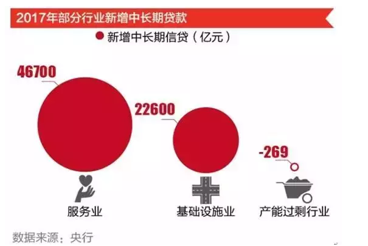

# 我命令，把钱赶到实体经济 \#1800
-------------------------------

原创： yevon\_ou [[水库论坛]](/) 2018-05-15

 我命令，把钱赶到实体经济 ~\#1800~
============================================================================================================================

 

经济学，太复杂

 

 

一）       宁南山

 

《宁南山》无疑是大家。

他每周写一篇文章，每篇12000字。哥哥每次都是跪着看完的。

 

内容包罗万象，无奇不有。

从京东方电子面板生产，到民航科技研发比例，到数控机床升级链，到汽车配件合资分析，每一篇都是大家。每一篇，都深入浅出，振奋人心。

 

哥哥一边看，一边想，这样的研究深度，哪怕一些专业的"智囊级"公司，也写不出啊。一个学院能有一二篇，就足以屹立开课了。

而且《宁南山》还是完全完全不接广告的。这就更加神仙了。真是人比人，境界不同啊。

 

今天早上，宁南山写了一篇《[[2018中国经济的一些走向和个人应对思考]](https://mp.weixin.qq.com/s?__biz=MzI0Mjc2NDc2OQ==&mid=2247484525&idx=1&sn=6ec839d1f57aacae11f41a11243dfc10&chksm=e9761ae3de0193f5ac19f24c94a12d5d3729066585e60dd84fecf7f1b9b54c5b6834e449b45a&scene=21&pass_ticket=KMB8tEO0TnDRPXNCRrgKSoBRzGyaOqwlvB%20bqA9HW0tk#wechat_redirect)》，把房地产痛骂了一通。

这篇文章，是错误的。

 

 

二）       失血论

 

宁南山举了一个非常典型，老生常谈，房网从2003年开始就不断反复的论调：

钱都去房地产了，那实体经济怎么办

 

 

最早从2002年开始，一开始是上海热线ehome，大大小小的民科，满怀怨气，控诉房地产的"罪恶"。

搜肠刮肚，最后找出来的说辞，"钱都去房地产了，剥夺了其他产业的发展机会"。

 

君不见，国家一直说"内需不振"。

各行各业，无论是卖彩电的，卖冰箱的，卖汽车的，卖塑料铅桶，卖瓜果零食，卖手机（哦，卖手机不算）；

各行各业，纷纷吐槽"内需不振"。不可以闭着眼睛，毫不创新，坐着分享+30%的年复增长。

 

年终会议，老板问为什么无能啊。窝囊干部众口一词"内需不振"，都被房地产吸走了。

好像数万亿的资金，若是不拿去买房子，一定可以多买几个彩电。股市中人，苦旱已久，抬轿子多几个涨停板。

 

这个观点是正确的么？

宁南山也继承了这个观点。甚至大声喊出了"计划经济"的口号，调参数，把信贷多往"实体经济"赶一点，让资金少进入房地产行业。

 

我要告诉各位，从经济学上讲，这个模型是彻头彻尾错误的。

 

 

货币本身是没有意义的。我们今天吃一碗面条，味千拉面35元。

其实这个价格，标0.35元，3.5元，35元，350元，35000元，都是可以的。

没有任何区别的。

 

所谓的资金不足，导致"实体经济"运转困难，根本不是问题。

按照中国目前的总M2，假设是200万亿吧。

假设房地产占60万亿，实体占140万亿。

 

在"真正"的经济学中，实体经济这140万亿，14万亿，1.4万亿，都是等价的。

哪怕我"留给"实体经济的现金，只有140亿。

经济依然可以完善运转，不会有任何问题的。

 

 

如果真的"留给"实体经济，只有14万亿，那会发生什么情况。

情况就是，所有的物价，砍掉一个零。

 

你去吃一碗拉面，商家仅只收你3.5元。

你买一个彩电，现在只要600元，而不是6000元。

一个月的工资，1500\~2000元。

你卖不出去的塑料铅桶，还是卖不出去。

 

 

很多商家，把"内需不振"的帽子，扣在房地产头上。好像房地产抽走60万亿资金，使得购买力减少了。这部分钱回来，购买力就会增加，塑料铅桶小老板就会挣大钱。

这是不对的。

 

在正统的经济学中，既然"产能"没有增加。单纯的货币增加了，只会引发通货膨胀。

塑料铅桶是卖出去了，售价也增加了，小老板过了二三个月的快乐时光。

 

但他很快就会发现，聚氯乙烯原材料涨价了，铁柄马上涨价了，工人跑过来喊要加工资了。

零售价和成本一样，都在以+20%的速度上涨。

而当你赚了钱，出去消费。味千拉面也涨价了，足浴保健也涨价了，公交汽油也涨价了。一切又回到了原点，你的生活质量没有获得任何改善。

 

 

我知道"内需不振"，开家小厂，闭着眼睛每年+30%的好日子已经过去了。

可是过去十年，还是有很多公司活下来的。

真正活得好的公司，无一不是"创新""励精图治"。

 

"内需不振"对每一个人都是不振的，困难对每一个人都是困难的。

但别人可以奋起，是因为抓住了移动互联网，大工业化，人工智能AI，数据链云计算等等风口。

而不是坐在家里，抱怨成为"铁锈区"。

 

 

 

三）       二元经济悖论

 

别人或许会说，"咦，不是还有一个房地产市场么，占据60万亿"。

对，这其实是一个"二元经济悖论"。

 

还是以全国的总现金M2=200万亿举例。我们有二个市场："实体"和"房地产"

a.  140+60

b.  120+80

c.  140+80

d.  154+66，经济增长+10%

 

 

我们有几种情况，第一种是常规的140+60.

 

第二种是极端的，把资金往房地产市场赶，120+80

在这种情况下，通常会发生"通货紧缩"+"房价飞涨"。

也就是说，实体难熬。但是难熬的结果，成本下降，售价下降，最后大家扯平。该卖七万个铅桶，还是七万铅桶。

只是眼红地产佬发财。

 

 

第三个情况，140+80=220

请注意这个情况下，总额是220，而不是200，也就是国家滥发纸币，增发了+10%

这个情况下，"实体经济"的现金血量，还是140万亿，不变。

而房地产增加了20万亿，成为了"通货膨胀宣泄口"。

国家获得了印钞的NN钱。

 

 

所谓的"二元经济悖论"，主要指这个情况：

房地产的大量资金涌入，房价高企。

会不会吸引更多的资源，来建设房子。从而耗占钢筋，水泥，人力。

 

 

如果你是一个"基础功"很扎实的经济学学生，懂得推砌里面的原理，而不是简单地背诵公式。

你是不会傻乎乎说出"房价暴涨，耗占社会资源"这种文盲蠢话的。

 

正统的"经济学"教育，他是容许资金涌入，房价暴涨的。

正统的经济学理论，其逻辑链条是：价格暴涨赚钱\-\--吸引更多资本进入\-\--开发更多供应\-\--价格下跌

 

朋友们啊，读书要读其灵魂。

学霸和学渣，就在于有没有庖丁解牛。

 

 

正统的经济学理论认为，房价暴涨，必然吸引了大量的资源，前来开发房屋。

-   本来准备造铁路，大桥的Steel，现在都拿来造大厦了。

-   本来准备搞生态农业，码头货栈的土地，都拿来盖房子了。

就象日本1989年一样，"转性"土地非常非常多，最终导致东京楼市崩溃。

 

-   原本用于造铁路，造汽车的钢铁，都拿来造房子，这才叫做"实体经济失血"。

-   原本用于生态农业，码头货栈的土地，都拿来造房子，这才叫做"实体经济失血"。

 

 

然后你再看看，在中国这片神奇的土地，所谓的"实体经济失血"，其实是不存在的！！

庖丁解牛，拳法打到这一层，中国是不符合"传统经济学"的。

 

中国的房地产价格上涨，几乎已经完全变成了一种"货币现象"。

意思就是说，房价你可以涨，可以翻倍，可以暴涨。

但是哪怕你从3000/m，暴涨到70000/m，供应也绝不会增加一根钢筋！

 

 

在中国，这里"经济学链条"是切断的。

房价已经完全变成了货币现象。

无论房价多高，我们也不会"增加供应"。

通过严格的土地管制，牌照管制。开工量和价格是完全无关联的！

 

那么，你说房价的上涨，会侵占"实体经济资源"么。会延缓我们造高速公路的物资资源么。

完全不会。

 

 

 

四）       结语

 

大老板的心里，清楚得很。

"实业救国"，中国既要发展汽车业，又要发展手机业。还要发展大飞机。最近又要举国之力，打造"芯片产业"。

 

在国家急需的各种"物质文明"中，房子是最最低优先级的。

老百姓住得差一点，会死嘛。

（最新研究表明，房子太小会导致低生育率，或许是件大事）

 

 

中国需要的是军事工业。因此钢铁，电子，汽车，飞机，都获得了优先发展。

要卡断房地产的喉咙，十分简单，不给你发"建筑许可证"即可。

缩减供地规模，长期的没有土地，看你拿什么做馒头。

 

 

现在的中国学生，水平太低。读书不读透，知其一不知其二。只知道背公式，当中的推理过程完全忽略。

传统的西方经济学，是说"资金流入，侵占其他行业"。

但这是在"完美状态"，没有政府管制，资本自由流动的情况下说的。

 

如果我们加上"监管"，加上"合规"，这其实就是脑埂塞状态。

房地产行业，只要严格控制一手房的开发。则哪怕涌入再多的资金，也不会耗用钢铁水泥设计师产量。

供应不增加。

 

不耗国力，最多房价贵一点而已。

 

 

 

（yevon\_ou\@163.com，2018年5月13日午）
